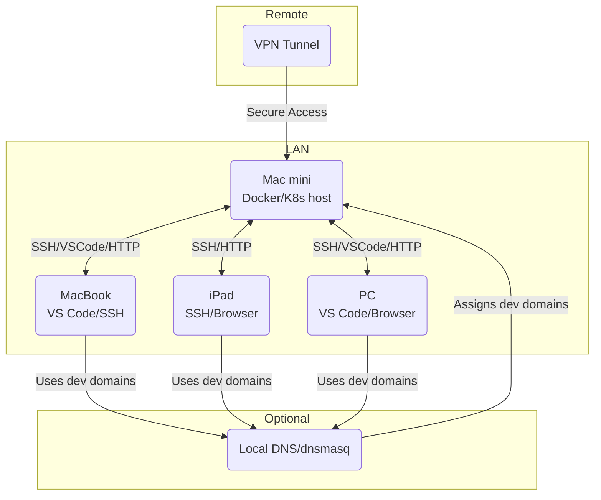

# Kubernetes Deployment Guide for Care-BFF

## Overview
This project is already configured for Kubernetes deployment with existing deployment manifests for different environments (UAT, STG, PROD).

## Prerequisites

1. **Docker** installed and configured
2. **kubectl** installed and configured with access to your cluster
3. **Azure Container Registry (ACR)** access - `smartone.azurecr.io`
4. **Kubernetes cluster** access with proper permissions
5. **Namespace**: `bff` should exist in your cluster

## Current Configuration

### Environments
- **UAT**: `deploy-uat.yaml`
- **STG**: `deploy-stg.yaml` 
- **PROD**: `deploy-prod.yaml`

### Container Registry
- Registry: `smartone.azurecr.io`
- Image: `smartone/care-bff`
- Current Version: `1.10.29`

### Endpoints
- **Production**: `https://care-api.smartone.com/care-bff/v0/graphql`
- **Staging**: `https://care-api.smartone.com/stg/care-bff/v0/graphql`

## Deployment Steps

### Step 1: Build the Docker Image

```bash
# Set version number
set VERSION=1.10.30

# Build the Docker image
docker build -t smartone.azurecr.io/smartone/care-bff:%VERSION% .

# Tag as latest (optional)
docker tag smartone.azurecr.io/smartone/care-bff:%VERSION% smartone.azurecr.io/smartone/care-bff:latest
```

### Step 2: Push to Azure Container Registry

```bash
# Login to ACR
az acr login --name smartone

# Or use docker login
docker login smartone.azurecr.io

# Push the image
docker push smartone.azurecr.io/smartone/care-bff:%VERSION%
docker push smartone.azurecr.io/smartone/care-bff:latest
```

### Step 3: Update Deployment YAML

Update the image version in the appropriate deployment file:

**For Production** (`deploy-prod.yaml`):
```yaml
spec:
  template:
    spec:
      containers:
        - name: care-bff
          image: smartone.azurecr.io/smartone/care-bff:1.10.30  # Update version here
```

**For Staging** (`deploy-stg.yaml`):
```yaml
spec:
  template:
    spec:
      containers:
        - name: care-bff-stg
          image: smartone.azurecr.io/smartone/care-bff:1.10.30  # Update version here
```

### Step 4: Deploy to Kubernetes

#### For Staging Environment:
```bash
# Apply the deployment
kubectl apply -f deploy-stg.yaml

# Verify deployment
kubectl get pods -n bff -l app=care-bff-stg

# Check logs
kubectl logs -n bff -l app=care-bff-stg --tail=100

# Check service
kubectl get svc -n bff care-bff-stg

# Check ingress
kubectl get ingress -n bff care-bff-stg
```

#### For Production Environment:
```bash
# Apply the deployment
kubectl apply -f deploy-prod.yaml

# Verify deployment
kubectl get pods -n bff -l app=care-bff

# Check logs
kubectl logs -n bff -l app=care-bff --tail=100

# Check service
kubectl get svc -n bff care-bff

# Check ingress
kubectl get ingress -n bff care-bff
```

### Step 5: Verify Deployment

```bash
# Check pod status
kubectl get pods -n bff

# Describe pod for details
kubectl describe pod -n bff <pod-name>

# Check pod logs
kubectl logs -n bff <pod-name> -f

# Test the endpoint
curl https://care-api.smartone.com/care-bff/v0/graphql -X POST -H "Content-Type: application/json" -d "{\"query\":\"{ __schema { queryType { name } } }\"}"
```

## Rolling Update Strategy

For zero-downtime deployment:

```bash
# Update the image version in the deployment
kubectl set image deployment/care-bff care-bff=smartone.azurecr.io/smartone/care-bff:1.10.30 -n bff

# Monitor rollout status
kubectl rollout status deployment/care-bff -n bff

# Check rollout history
kubectl rollout history deployment/care-bff -n bff
```

## Rollback

If something goes wrong:

```bash
# Rollback to previous version
kubectl rollout undo deployment/care-bff -n bff

# Rollback to specific revision
kubectl rollout undo deployment/care-bff -n bff --to-revision=2
```

## Scaling

```bash
# Scale production replicas
kubectl scale deployment/care-bff --replicas=20 -n bff

# Scale staging replicas
kubectl scale deployment/care-bff-stg --replicas=4 -n bff

# Auto-scaling (create HPA)
kubectl autoscale deployment care-bff --cpu-percent=70 --min=16 --max=32 -n bff
```

## Resource Configuration

### Production (deploy-prod.yaml)
- Replicas: 16
- CPU Limits: 1000m (1 core)
- Memory Limits: 1536Mi
- CPU Requests: 500m
- Memory Requests: 512Mi
- Port: 5001

### Staging (deploy-stg.yaml)
- Replicas: 2
- CPU Limits: 500m
- Memory Limits: 1024Mi
- Port: 5000

## Environment Variables

The following environment variables are set in the deployment:

- `ENV`: Environment name (PROD, STG, UAT)
- `TZ`: Asia/Hong_Kong
- `NODE_TLS_REJECT_UNAUTHORIZED`: "0"
- `BYPASS_SWITCH_ACCOUNT_JWT`: "true" (STG only)

## Troubleshooting

### Check Pod Status
```bash
kubectl get pods -n bff
kubectl describe pod -n bff <pod-name>
```

### View Logs
```bash
kubectl logs -n bff <pod-name> -f
kubectl logs -n bff <pod-name> --previous  # For crashed pods
```

### Check Service Endpoints
```bash
kubectl get endpoints -n bff care-bff
```

### Test Service Internally
```bash
kubectl run -it --rm debug --image=curlimages/curl --restart=Never -n bff -- sh
# Inside the pod:
curl http://care-bff:5001/care-bff/v0/graphql
```

### Check Ingress
```bash
kubectl describe ingress -n bff care-bff
```

### Check Resource Usage
```bash
kubectl top pods -n bff
kubectl top nodes
```

## CI/CD Pipeline Integration

### Example GitHub Actions Workflow

```yaml
name: Deploy to K8s

on:
  push:
    branches: [main]

jobs:
  deploy:
    runs-on: ubuntu-latest
    steps:
      - uses: actions/checkout@v2
      
      - name: Login to ACR
        run: |
          echo ${{ secrets.ACR_PASSWORD }} | docker login smartone.azurecr.io -u ${{ secrets.ACR_USERNAME }} --password-stdin
      
      - name: Build and Push
        run: |
          VERSION=$(cat package.json | grep version | head -1 | awk -F: '{ print $2 }' | sed 's/[",]//g' | tr -d '[[:space:]]')
          docker build -t smartone.azurecr.io/smartone/care-bff:$VERSION .
          docker push smartone.azurecr.io/smartone/care-bff:$VERSION
      
      - name: Deploy to K8s
        run: |
          kubectl apply -f deploy-stg.yaml
          kubectl rollout status deployment/care-bff-stg -n bff
```

## Health Checks

Consider adding health check endpoints to your application and update the deployment:

```yaml
spec:
  containers:
    - name: care-bff
      # ...existing config...
      livenessProbe:
        httpGet:
          path: /health
          port: 5001
        initialDelaySeconds: 30
        periodSeconds: 10
      readinessProbe:
        httpGet:
          path: /ready
          port: 5001
        initialDelaySeconds: 10
        periodSeconds: 5
```

## Important Notes

1. **Secrets Management**: Consider using Kubernetes Secrets or Azure Key Vault for sensitive data in `app.config.json`
2. **ConfigMaps**: Consider externalizing configuration using ConfigMaps
3. **PEM Files**: Ensure `private.pem` and `public.pem` are included in the Docker image or mounted as secrets
4. **Redis Connection**: Ensure Redis endpoints are accessible from the cluster
5. **Host Aliases**: The deployment uses custom host aliases for internal routing
6. **TLS Certificates**: Ensure the TLS secret `care-api.smartone.com` exists in the namespace

## Next Steps

1. Set up automated CI/CD pipeline
2. Implement proper secrets management
3. Add monitoring and alerting (Prometheus/Grafana)
4. Set up log aggregation (ELK stack or Azure Monitor)
5. Configure auto-scaling based on metrics
6. Implement backup and disaster recovery procedures



